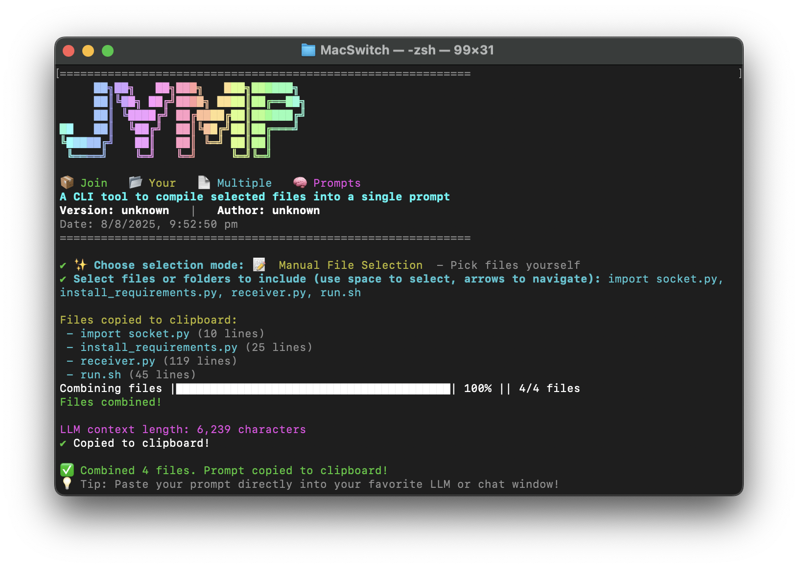

# JYMP


> **JYMP** (Join Your Multiple Prompts) is a beautiful, interactive CLI tool to combine selected files from your codebase into a single prompt for LLMs, code review, or sharing. It features a modern UI, AI-assisted file selection, and clipboard integration.

---



---

## Features

- 📦 **Full Codebase Mode**: Combine all files (except ignored) into one prompt.
- 🤖 **Prompt-Based (AI-assisted) Mode**: Let AI suggest the most relevant files for your goal.
- 📝 **Manual File Selection**: Pick files and folders from a beautiful tree view.
- 🧠 **Clipboard Integration**: Output is automatically copied to your clipboard.
- 📄 **File Info**: See the number of lines for each file before combining.
- 🖼️ **Smart Handling**: Images and binaries are listed by name only, not content.
- ✨ **Modern Banner & UX**: Enjoy a creative, professional CLI experience.

## Installation

1. Clone this repo:
   ```sh
   git clone https://github.com/mahendra189/jymp.git
   cd jymp
   ```
2. Install dependencies:
   ```sh
   npm install
   ```
3. (Optional) Make globally available:
   ```sh
   npm link
   # Now you can run `jymp` from anywhere
   ```

## Usage

Run the CLI from your project root:

```sh
node index.js
# or, if linked globally
jymp
```

### Modes
- **Full Codebase**: Combines all files (except those in `.jympignore`).
- **Prompt-Based (AI-assisted)**: Enter your goal, and the AI will select the most relevant files.
- **Manual File Selection**: Use arrow keys and space to select files/folders from a tree view.

### Example


## .jympignore
Add file/folder patterns to `.jympignore` to exclude them from selection (like `.gitignore`).

## AI Integration
- Uses OpenRouter (OpenAI-compatible) for prompt-based selection. You can set your API key in the code or via environment variable.

## Customization
- Edit `index.js` to change the banner, selection UI, or AI model.


---

> Made with ❤️ by Mahendra
